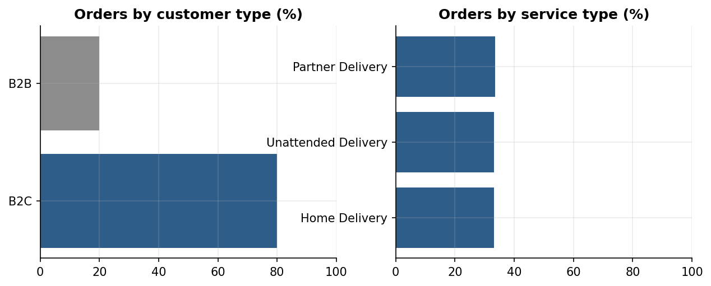
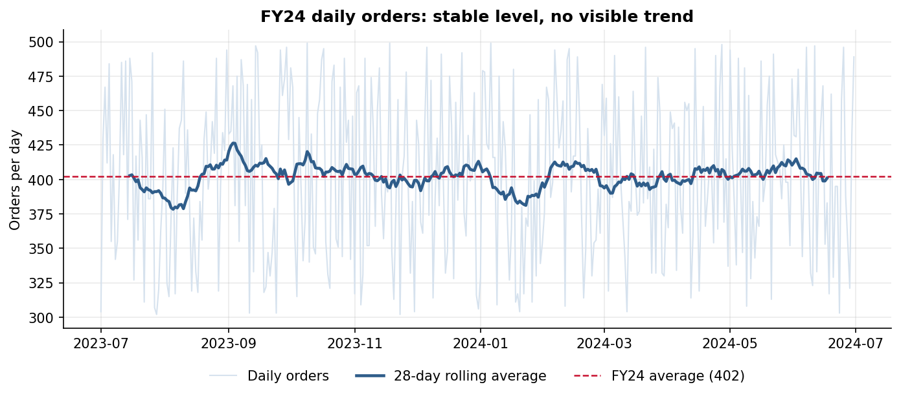
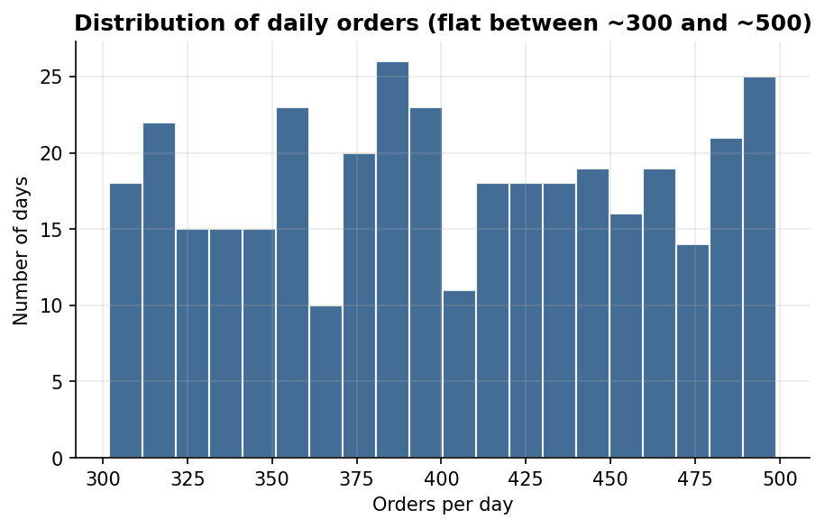
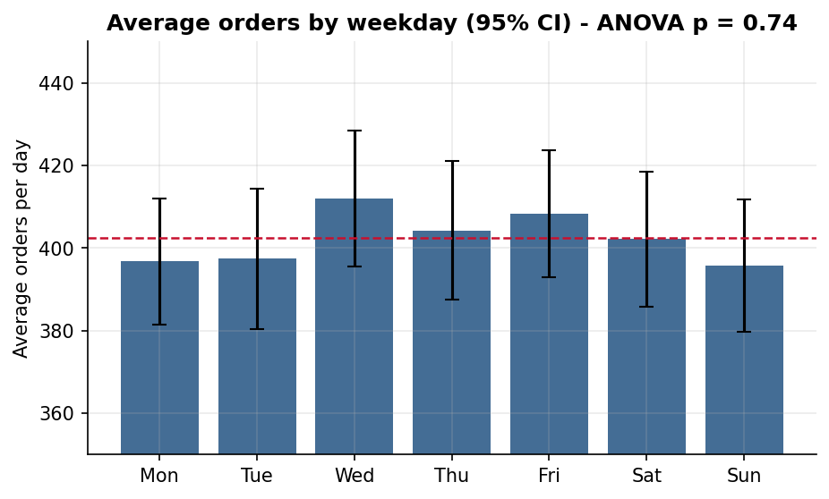
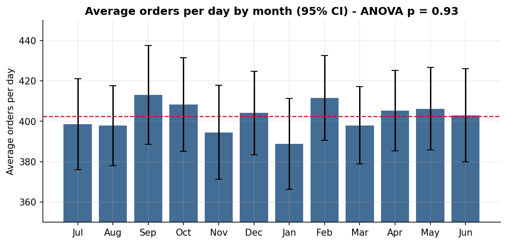

# Exploratory Data Analysis – FY24 CFC Orders

Source: `src/eda.py` · Full results: `outputs/eda_summary.json`

## 1. Data profile

| Item | Value |
|---|---|
| Period | 1 Jul 2023 – 30 Jun 2024 (366 days, FY24 includes 29 Feb) |
| Orders (rows) | 147,269 |
| Sales | $14,711,110 |
| Units | 3,163,749 |
| Unique customers | 2,000 |
| Missing values | None |

**Data quality notes**

- **Order ID collisions.** 1,237 order IDs appear more than once (2,463 rows). The rows sharing an ID have different dates, customers and values, and no row is fully duplicated. These are ID collisions, not duplicate orders, so every row is kept.
- **Date-only submit times.** `Order Submit Date` holds a date with no time, while `Delivery Date` includes a time. Lead times are therefore measured from midnight on the order date.

## 2. Order characteristics

| Measure | Average | Range |
|---|---|---|
| Order value | $99.89 | $50.00 – $150.00 |
| Units per order | 21.5 | 11 – 32 |
| Lead time (order date to delivery) | median 39.6 h, mean 50.4 h | 6 – 189 h |

| Segment | Orders | Share | Sales | Avg order value |
|---|---|---|---|---|
| B2C | 117,811 | 80.0% | $11.78M | $99.97 |
| B2B | 29,458 | 20.0% | $2.93M | $99.60 |

Service types split almost exactly into thirds (Partner 33.5%, Unattended 33.3%, Home 33.2%). The split is the same within B2C and B2B. Order value and basket size barely differ by segment, so order volume is what drives the forecast.

## 3. Daily order volume

| Mean | Median | Std dev | Min | Max | Coefficient of variation |
|---|---|---|---|---|---|
| 402.4 | 398 | 58.1 | 302 | 499 | 14.4% |

The 28-day rolling average stays close to 402 all year. Daily values are spread evenly between about 300 and 500. A Kolmogorov–Smirnov test cannot reject a uniform distribution (p = 0.66).

## 4. Trend

| Test | Result |
|---|---|
| Linear trend | +0.0013 orders/day per day (≈ +0.5 orders/day over the year), p = 0.96 |
| First half vs second half | 403.3 vs 401.5 per day, t-test p = 0.77 |
| First 30 days vs last 30 days | 398.7 vs 403.0 per day (within normal variation) |

**Conclusion:** there is no growth trend in FY24.

## 5. Seasonality

Averages are compared **per day**. Monthly totals would mostly reflect the number of days in each month. Saturday and Sunday occur 53 times in FY24 and other weekdays 52 times.

**Day of week** (average orders per day, ± 95% confidence interval)

| Mon | Tue | Wed | Thu | Fri | Sat | Sun |
|---|---|---|---|---|---|---|
| 396.8 ±15 | 397.4 ±17 | 412.0 ±16 | 404.3 ±17 | 408.3 ±15 | 402.2 ±16 | 395.7 ±16 |

ANOVA p = 0.74. The confidence intervals all overlap, so there is no real weekly pattern.

**Month** (average orders per day)

| Jul | Aug | Sep | Oct | Nov | Dec | Jan | Feb | Mar | Apr | May | Jun |
|---|---|---|---|---|---|---|---|---|---|---|---|
| 398.5 | 397.9 | 413.1 | 408.3 | 394.5 | 404.1 | 388.8 | 411.6 | 398.0 | 405.3 | 406.2 | 403.0 |

ANOVA p = 0.93. Each monthly average has a 95% interval of roughly ±20–25 orders, so no month is different from the others.

**Autocorrelation:** lag 1 = −0.02, lag 7 = −0.04, lag 14 = −0.06, lag 30 = −0.04. All sit inside the ±0.10 white-noise band. A busy day tells us nothing about the next day or the same day next week.

## 6. Historical promotional periods

| Window | Average orders/day | vs FY24 average |
|---|---|---|
| Black Friday weekend 2023 (24–27 Nov) | 422 | +4.9% |
| FY end 2024 (24–30 Jun) | 420 | +4.3% |

Both are within normal variation for a 4–7 day window (about ±5–7%). FY24 contains no measurable promotional uplift. The promotional effects in the forecast are therefore assumptions, not estimates.

## 7. Key insights

1. **Stable demand.** FY24 orders are a stable level of about 402 a day plus random day-to-day variation of about ±58.
2. **No trend or seasonality.** Neither weekly nor monthly patterns are statistically significant, so apparent peaks such as Wednesdays or September are noise. This means the brief's seasonality index would be flat (1.0) for this data.
3. **Uncertainty comes from daily noise.** Planning should use ranges (for example, 330–474 orders on 80% of days), not a single number.
4. **Promotions are untested.** The history shows no visible promotional effect, so promotional uplift must be treated as an assumption and validated once FY25 campaigns run.
5. **Volume drives everything.** B2C/B2B mix, service mix, order value and basket size are all stable, so order volume is the variable that matters for capacity.

## 8. Implications for the model

A model that tries to learn weekly or monthly patterns from this data will fit noise. The model should be tested against a simple average benchmark, and complexity added only where it improves out-of-sample accuracy (see [MODEL.md](MODEL.md)).
