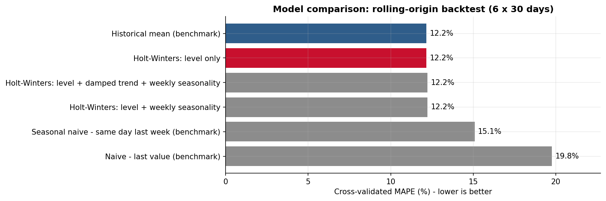
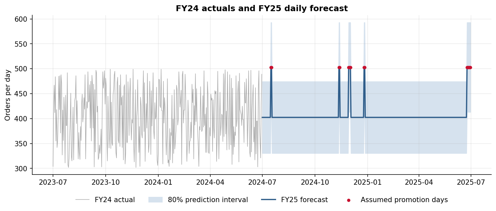
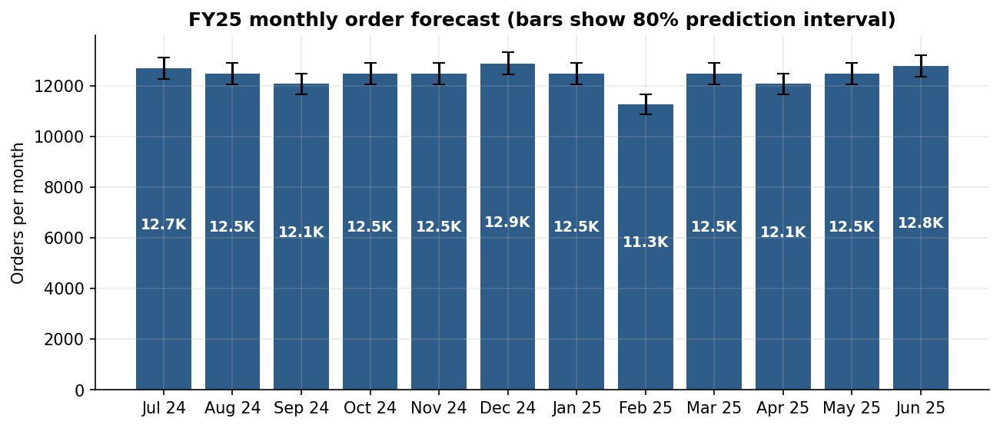
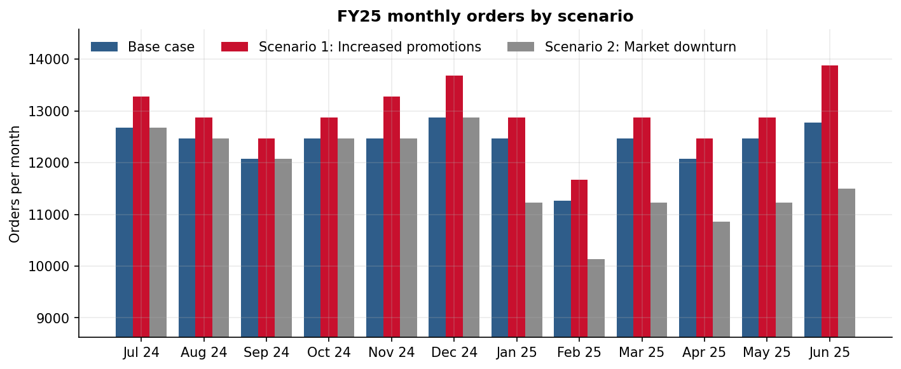

# Forecast Model, FY25 Forecast Report and Scenario Analysis

Sources: `src/forecast.py`, `src/scenarios.py` · Results: `outputs/`

---

# Part 1 – Forecast model

## 1.1 Approach

The method follows three steps:

1. **Test** candidate models on data they have not seen.
2. **Select** the simplest model that forecasts as well as any other.
3. **Add** business assumptions (promotions) as explicit, editable adjustments.

Holt-Winters exponential smoothing was chosen as the model family because it:
- separates a series into level, trend and seasonal parts, so each part can be tested for whether it is needed
- is transparent and quick to refit as new data arrives
- updates automatically if the level of demand shifts

## 1.2 Candidate models

| Model | Description |
|---|---|
| Historical mean (benchmark) | Average of all training days |
| Naive (benchmark) | Repeat the last observed day |
| Seasonal naive (benchmark) | Repeat the same weekday from last week |
| Holt-Winters: level only | Exponentially weighted level, no trend or seasonality |
| Holt-Winters: level + weekly seasonality | Adds an additive 7-day seasonal pattern |
| Holt-Winters: level + damped trend + weekly seasonality | Full model |

Smoothing parameters are estimated by minimising in-sample squared error (`statsmodels` `ExponentialSmoothing`).

## 1.3 Validation

**Design:** rolling-origin cross-validation. The model is fitted on all data up to a cut-off and then forecasts the next 30 days, repeated over 6 consecutive cut-offs covering the last 180 days of FY24. This tests the models the way they would be used in practice.

| Model | MAPE | MAE | RMSE | Bias |
|---|---|---|---|---|
| **Holt-Winters: level only (selected)** | **12.16%** | **47.5** | **56.0** | 0.1 |
| Historical mean (benchmark) | 12.16% | 47.5 | 56.0 | 0.1 |
| Holt-Winters: level + weekly seasonality | 12.23% | 47.8 | 56.4 | 0.1 |
| Holt-Winters: level + damped trend + weekly seasonality | 12.23% | 47.8 | 56.4 | 0.2 |
| Seasonal naive | 15.09% | 60.2 | 74.9 | 8.7 |
| Naive | 19.76% | 74.0 | 89.0 | −39.0 |

**Findings**

- **Constant level.** Fitted on the full year, the level-only model estimates its smoothing parameter at α = 0.0. The model is effectively saying that recent days carry no extra information: the best estimate of tomorrow is the long-run level of 402.4 orders. It therefore matches the historical mean exactly.
- **No gain from seasonality or trend.** Adding weekly seasonality or a trend makes accuracy slightly worse. The extra terms fit noise, which confirms the EDA.
- **Naive methods are worse.** Methods that copy recent values perform much worse, because each day is independent of the ones before it.

**Selected model:** Holt-Winters, level only. On FY24 data this is equivalent to the historical average. It is kept as the production method because, when refitted each month, it will pick up a genuine level shift automatically (α rises above zero).

**Seasonality index:** none was supplied, and none of the tested seasonality was significant, so the effective index is 1.0 for every day and month. If a validated index becomes available, it can be applied as a multiplier on `base_forecast`, the same way promotions are applied.

## 1.4 Promotional adjustments

The brief asks for big promotions at FY end, Black Friday and competitors' mega sales. FY24 shows no measurable uplift in these periods (see [EDA.md](EDA.md) section 6), so promotions are applied as explicit assumptions:

| Event (assumed dates) | Dates | Days | Uplift |
|---|---|---|---|
| Competitor mega sale | 16–17 Jul 2024 | 2 | +25% |
| Competitor mega sale | 12–13 Nov 2024 | 2 | +25% |
| Black Friday to Cyber Monday | 29 Nov – 2 Dec 2024 | 4 | +25% |
| Competitor mega sale (Boxing Day) | 26–27 Dec 2024 | 2 | +25% |
| End of financial year | 24–30 Jun 2025 | 7 | +25% |

`final_forecast = base_forecast × promo_multiplier`. The multiplier is stored per day in `outputs/forecast_daily.csv`, so it can be changed for any event without refitting the model.

## 1.5 Prediction intervals

- **Daily:** ± z × 56 orders. The 56 is the out-of-sample RMSE from the backtest, combined with the uncertainty in the level (standard error 3.0 orders/day). On promotional days the interval is scaled by the multiplier.
- **Weekly, monthly and annual:** daily errors are independent (autocorrelation ≈ 0), so random noise grows with the square root of the number of days. Uncertainty in the level grows in proportion to the number of days. Both are combined. The intervals are **not** built by summing daily bounds, which would overstate the range.
- The intervals cover statistical noise only. Uncertainty in the promotional assumption and in market conditions is handled by the scenarios in Part 3.

## 1.6 Assumptions

1. FY25 demand behaves like FY24: the same level and no trend or seasonality.
2. Daily variation is independent and similar in size to FY24.
3. Promotional uplift is +25% on the listed days (assumption, to be validated).
4. No capacity cap: forecasts represent demand, not fulfilled orders.
5. No market trends report was provided. Changes in consumer behaviour are covered by scenarios rather than built into the base case.

---

# Part 2 – FY25 forecast report

## 2.1 Headline

| | FY24 actual | FY25 forecast |
|---|---|---|
| Total orders | 147,269 (366 days) | **148,586** (365 days) |
| Average per day | 402.4 | 407.1 |
| Baseline (no promotions) | – | 402.4 per day, 146,876 in total |
| Incremental orders from promotions | – | 1,710 over 17 days |
| 80% interval, total | – | 146,588 – 150,585 |
| 95% interval, total | – | 145,530 – 151,642 |

FY25 total orders are 0.9% above FY24, and orders per day are 1.2% higher. All of that increase comes from the assumed promotions. Holding the average order value at the FY24 level of $99.89, FY25 sales would be about $14.8M.

## 2.2 Daily

| Day type | Expected | 80% range | 95% range |
|---|---|---|---|
| Regular day (348 days) | 402 | 330 – 474 | 292 – 512 |
| Promotional day (17 days) | 503 | up to 593 | up to 641 |

File: `outputs/forecast_daily.csv`. Columns: date, base_forecast, promo_multiplier, promo_type, is_promo, final_forecast, lower_95, upper_95, lower_80, upper_80.

## 2.3 Weekly

A regular week is forecast at **2,817 orders** (80% range 2,625 – 3,009). Weeks containing promotions are higher. The FY-end week of 23 June 2025 is forecast at 3,420 orders.

File: `outputs/forecast_weekly.csv` (weeks start on Monday; the first and last weeks may be partial, see the `days` column).

## 2.4 Monthly

| Month | Days | Promo days | Forecast | 80% range |
|---|---|---|---|---|
| Jul 2024 | 31 | 2 | 12,676 | 12,251 – 13,100 |
| Aug 2024 | 31 | 0 | 12,474 | 12,057 – 12,892 |
| Sep 2024 | 30 | 0 | 12,072 | 11,662 – 12,482 |
| Oct 2024 | 31 | 0 | 12,474 | 12,057 – 12,892 |
| Nov 2024 | 30 | 4 | 12,474 | 12,050 – 12,898 |
| Dec 2024 | 31 | 4 | 12,877 | 12,446 – 13,308 |
| Jan 2025 | 31 | 0 | 12,474 | 12,057 – 12,892 |
| Feb 2025 | 28 | 0 | 11,267 | 10,872 – 11,663 |
| Mar 2025 | 31 | 0 | 12,474 | 12,057 – 12,892 |
| Apr 2025 | 30 | 0 | 12,072 | 11,662 – 12,482 |
| May 2025 | 31 | 0 | 12,474 | 12,057 – 12,892 |
| Jun 2025 | 30 | 7 | 12,776 | 12,342 – 13,211 |
| **FY25** | **365** | **17** | **148,586** | **146,588 – 150,585** |

Monthly differences come only from the number of days in each month and the promotions it contains.

## 2.5 Key insights

1. **Plan on ranges.** Daily orders will fall between 330 and 474 on 80% of regular days. Staffing and stock should flex across that range rather than target 402.
2. **Totals are predictable.** The annual total is predictable to within about ±1.3% (80% interval). Totals are far more predictable than individual days, which makes the forecast reliable for budgeting.
3. **Promotions are the biggest uncertainty.** Their effect has not been observed in the data, so measuring the uplift from the first FY25 events matters more than refining the model.

---

# Part 3 – Scenario analysis

## 3.1 Scenarios

| Scenario | Promotional uplift | Promo days | Market shift |
|---|---|---|---|
| Base case | +25% | 17 | None |
| Scenario 1: Increased promotions | +50% | 41 (adds the first Friday and Saturday of each month) | None |
| Scenario 2: Market downturn | +25% | 17 | −10% on underlying demand from 1 Jan 2025 (e.g. a competitor price war or cost-of-living pressure) |

## 3.2 Results

| Metric | Base case | Scenario 1 | Scenario 2 |
|---|---|---|---|
| FY25 orders | 148,586 | 155,125 | 141,232 |
| Change vs base | – | +6,539 (+4.4%) | −7,354 (−4.9%) |
| Average per day | 407.1 | 425.0 | 386.9 |
| Peak day, expected | 503 | 604 | 503 |
| Peak day, 80% upper bound | 593 | 711 | 593 |
| Days where the 80% upper bound exceeds 550* | 17 | 41 | 10 |

*550 orders/day is an illustrative planning capacity. Replace it with the actual CFC capacity in the Excel tool.

**Interactive tool:** `outputs/scenario_tool.xlsx`. Change the yellow input cells (uplift, extra promotions, market shift and start date, capacity), and all daily, monthly and summary figures recalculate.

## 3.3 Recommendations

**Scenario 1: Increased promotions**
- **Plan capacity for the upper bound.** Promotional days should be planned for about 710 orders, not the expected 604. Scenario 1 creates 41 high-demand days, 24 more than the base case.
- **Measure before committing.** FY24 shows no measurable promotional uplift, so measure the actual uplift on the first FY25 events. Compare each promotional day with the same weekday in the previous four weeks, then replace the assumed multiplier with the measured one.
- **Check the net effect.** Look for demand pulled forward (lower orders just after a promotion). Only the net gain should be added to the forecast.

**Scenario 2: Market downturn**
- **Use a monitoring trigger.** Track the 28-day rolling average of actual orders. A move of more than **21 orders/day (±5.3%)** away from the 402 baseline is beyond normal variation (two standard errors) and signals a real shift.
- **Re-base when triggered.** Refit the model when the trigger fires. Holt-Winters will move its level to the new demand automatically, and the rest of the year's forecast updates with it.
- **Flex cost, not service.** Scale variable labour and inventory down by the size of the shift (about 10% here) while protecting service levels. Keep the promotional calendar, since promotions support volume in a weaker market.

**Both scenarios**
- Refit the model monthly and review the promotional multipliers after each event.
- Report the forecast as a range (80% interval) as well as the point forecast.

---

# Limitations and next steps

- **One year of history.** This limits validation. Yearly seasonality cannot be estimated from a single cycle, even though none is visible within the year.
- **Aggregate volume only.** Item-level forecasting (thousands of products, new products without history, different units of measure) needs a different approach, such as machine-learning models using product attributes. This order-level forecast complements such models by setting the total volume for capacity and budget planning.
- **Interaction with stores.** Online growth may shift demand away from nearby physical stores. Channel interaction should be considered when setting growth targets.
- **Next steps:**
  - Add FY25 actuals as they arrive.
  - Estimate promotional uplift from real campaigns.
  - Add external drivers (marketing spend, competitor activity) once data exists.
